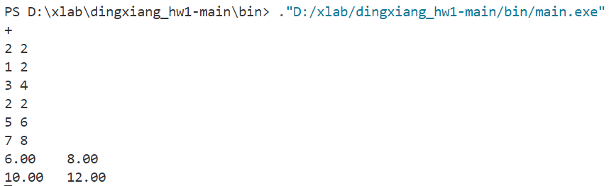
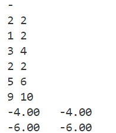
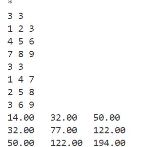
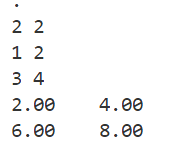
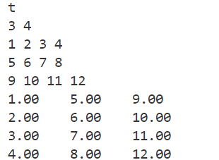
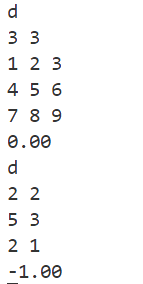
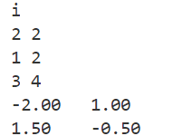
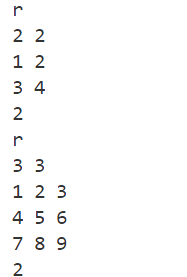
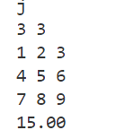

# ​1. 矩阵加法 add_matrix

**​思路**​：
检查两个矩阵的行列数是否一致
创建新矩阵，遍历每个元素进行相加

### 实例

# 2. 矩阵减法 sub_matrix
**​思路**​：
检查矩阵维度一致性
遍历每个元素执行减法运算
### 实例

# 3.矩阵乘法 mul_matrix

**​思路**​：

检查a的列数是否等于b的行数
三重循环计算点积：result[i][j] = Σ(a[i][k] * b[k][j])
### 实例

# ​4. 矩阵数乘 scale_matrix

**​思路​**：

遍历矩阵所有元素进行标量乘法
### 实例

# ​**5. 矩阵转置 transpose_matrix**​

**​思路**​：

创建新矩阵，行列数互换
遍历原矩阵，赋值到转置位置：result[j][i] = a[i][j]
### 实例

# ​**6. 矩阵行列式 det_matrix**​

**​思路**​：

​高斯消元法将矩阵转换为上三角形式
对角线元素相乘得到行列式
### 实例

​
# **7. 矩阵求逆 inv_matrix**​

**​思路**​：

​高斯-约当消元法​：
构造增广矩阵 [A|I]
通过行变换转换为 [I|A⁻¹]
### 实例

​
# **8. 矩阵秩 rank_matrix**​
**​思路**​：

​高斯消元法转换为行阶梯形
统计非零行的数量
### 实例

​
# **9. 矩阵迹 trace_matrix**​

**​思路**​：

检查是否为方阵
遍历对角线元素求和
### 实例

